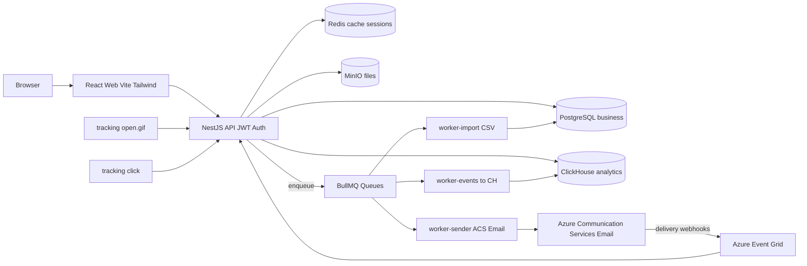

# SendMast Architecture

## Overview



## Send pipeline

1. User hits `POST /api/campaigns/:id/send`
2. API:
   - Validates the sender domain is verified
   - Materialises every subscribed contact in the selected lists into `campaign_recipients` (1 row each)
   - Enqueues a `send-campaign:dispatch` job in BullMQ
3. `worker-sender` consumes the dispatch job, paginates `campaign_recipients` (500 at a time), and bulk-enqueues `send-email` jobs (one per recipient)
4. `worker-sender` consumes `send-email` jobs:
   - Rewrites every `<a href>` in the campaign HTML to `/t/c/<token>?u=<original>` (per-recipient HMAC token)
   - Injects the open pixel `.gif">`
   - Adds RFC 8058 `List-Unsubscribe` + `List-Unsubscribe-Post` headers
   - Calls the configured transport (Mailhog SMTP in dev, Azure ACS Email in prod)
   - Updates the recipient row to `sent` + records the `messageId`
   - When all recipients are done, marks the campaign `sent`

## Tracking pipeline

- Open: `GET /t/o/:token.gif` -> verifies HMAC -> enqueues `events-ingest:event` -> returns 1x1 pixel
- Click: `GET /t/c/:token?u=URL` -> verifies HMAC -> enqueues event -> 302 redirect
- Unsubscribe (page): `GET /t/u/:token` -> verifies + processes -> renders confirmation page
- Unsubscribe (RFC 8058 one-click): `POST /t/u/:token` -> processes -> 200 OK

`worker-events` consumes the `events-ingest` queue, batches up to 500 rows / 1s, and bulk-inserts into `sendmast.email_events` in ClickHouse. Hard outcomes (bounce / complaint) are also reflected in PG (`suppression_entries` + `subscription_status`).

Azure Event Grid posts to `/api/webhooks/azure-event-grid` with delivery / bounce reports - the API translates the ACS schema and pushes the same `events-ingest` job format.

## Data model split

- **PostgreSQL (transactional)** — Users, accounts, sender domains, lists, contacts, templates, campaigns, recipients, suppressions, import jobs.
- **ClickHouse (analytical)** — `email_events` (one row per recipient action, MergeTree partitioned by month, TTL 24 months), `orders` and `attributions` (placeholders for v0.5).

## Deployment topology (target)

- 1 stateless API process behind a load balancer.
- N worker-sender processes (scale on send volume; rate-limited per domain via BullMQ rate limiter).
- 1-2 worker-events processes.
- 1 worker-import process per region.
- Postgres: managed; campaign_recipients and contacts will be hash-partitioned by `account_id` once table size demands it.
- ClickHouse: standalone single-node is fine through ~1B events; replicated cluster afterwards.
- Redis: managed Redis 7.

## Local development

```bash
pnpm infra:up   # docker-compose: pg + redis + clickhouse + minio + mailhog
pnpm db:migrate
pnpm ch:migrate
pnpm db:seed
pnpm dev        # all 5 processes
```

See [smoke-test.md](smoke-test.md) for the full E2E walkthrough.
